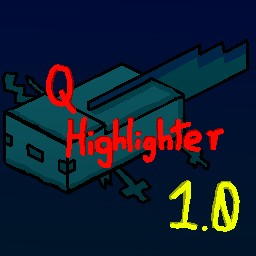

> [!CAUTION]
> Be careful when joining untrusted Q-Highlighter servers! Only connect to `qh.akarah.dev` or servers of those you trust!

# q-highlighter
Q-Highlighter is a mod for Hypixel SkyBlock that enables parties to forage together efficiently.

## Features
### Group System
Q-Highlighter's premiere feature is the **Group** system. You can use `/qh join-group` to connect to a server at a given URL (usually `qh.akarah.dev`), and a group ID to join that group. Groups enable:
- Allies in your group will be highlighted with a glow
- You can send waypoints to your allies, to clear them they must approach the waypoint
- You can use `/qh chat` to send messages to the group
- The UI will render your groupmates, and their stats and equipment

### Foraging Utilities
Q-Highlighter also has utilities for helping foraging:
- Advanced sweep data is displayed on the UI

# Usage
## Client
To use the mod clientside, download it and add it to your `mods` folder, and it should work! For commands, check the `/qh` command and subcommands. You can change Q-Highlighter's keybinds in your Controls menu, and you will be able to change settings about the mod itself in a Configuration menu through Mod Menu or `/qh config`.

## Server Self-hosting
Selfhosting a Q-Highlighter server is slightly more complicated, but definitely possible. You should set up a standard Minecraft Server with Fabric installed, and then add the Q-Highlighter mod to your `mods` folder. Then, you can start the server and connect to it at the server's IP address.

# Troubleshooting Errors
Sometimes, you may have issues connecting to servers or dealing with problems.

## Connection Errors
> ### Disconnected from server: Server is from the future
If you get this error, this means the server you are trying to connect to is **ahead** of your mod's version. You should go update your mod to the latest version ASAP.

> ### Disconnected from server: Server is too old
This means your mod is ahead of the server's version. Ask the server owner to update the mod on their server.
